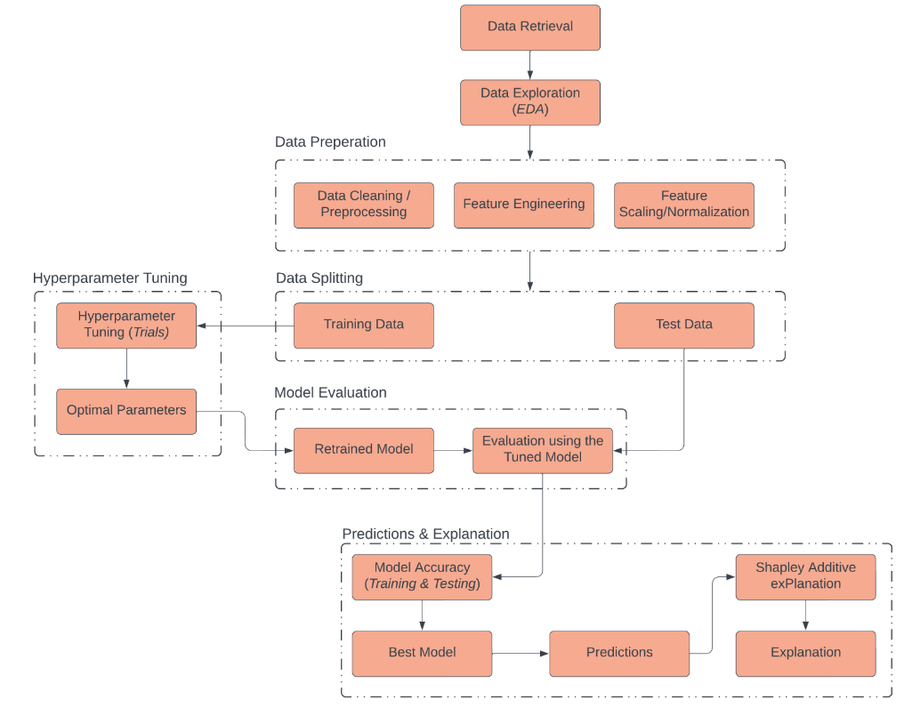

<h1 style='text-align: center;'>Predicting Adware Applications on Android Devices</h1>

<b>AGDEPPA, K.R | BERDON, J | MUSTARD, R.K | TAHOYNON, S.J</b>

<h2>Background</h2>

The use of mobile devices has become a crucial aspect of our daily routines due to the continuous advancements in technology. Android smartphones have notably gained immense popularity since their release in September 2008 (Callaham, 2018). 2019 Android continued to be the world's leading mobile operating system "Laricchia, 2019" with a 71.4% market share. Thanks to hardware advancements, mobile app development has seen significant progress. By September 2019, the Google Play Store had 2.7 million apps, while Apple's App Store had 2.46 million. According to Statistica, the number of mobile devices connected to the internet is expected to reach 20 billion by 2023.

Mobile apps have become essential as e-commerce, e-health, and payments become more accepted through digital transactions. Ads have also transitioned to the digital realm, appearing on websites and mobile applications while browsing. Due to the prevalence of the Android platform, a wide variety of applications are available on most smartphones. This rapid growth has, unfortunately, caused a surge in malicious apps. According to Statistica's report, 97% of 2022 Android applications on the Google Play Store were free in the first quarter of 2023, and the ratio of free to paid apps remained higher than one.

Mobile apps have become essential as digital transactions like e-commerce, eHealth, and payments become more prevalent. Meanwhile, advertisements have gone digital and can be seen while browsing websites or using mobile apps. Most smartphones run on the Android platform, resulting in a vast ecosystem of apps. Despite its rapid expansion, the prevalence of malicious apps is increasing. In the first quarter of 2023, Statistica (2022) reported that 97% of all Android applications were free, surpassing the number of paid apps on the Google Play Store.

<h2>Methodology</h2>

To solve problems effectively, it is crucial to comprehend the machine learning pipeline workflow for our project. This process includes data retrieval, data exploration, data preparation, modeling, hyperparameter tuning, model evaluation, and feature analysis.

<h2>About the Dataset</h2>

For this project, we obtained the dataset from Kaggle. It consists of four labels: Android_Adware, Android_Scareware, Android_SMS_Malware, and Benign. The dataset contains 355630 entries with 85 columns, and was obtained from the CIC repository. The current label distribution is as follows: 147443 for Android_Adware, 117082 for Android_Scareware, 67397 for Android_SMS_Malware, and 23708 for Benign. However, the proponents only used Android_Adware and Benign for binary classification, as Android_Adware is one of the most frequently encountered types of malware by users.

| Feature         | Data type     | Definition |
|--------------|-----------|------------|
| Source IP | str      | Refers to the IP address of the source device or sender in the network flow, determining the origin of the network traffic and identify potential sources of adware.        |
| Source Port  | int | Represents the communication endpoint on the sender's side. It helps in identifying the specific application or service sending the packets, providing insights into the type of traffic and identifying potential adware-related behavior.    |
| Destination IP      | str | This feature denotes the IP address of the destination device or receiver in the network flow. It identifies where the network traffic is being sent and potential adware targets.     |
|Destination Port      | float | It is the communication endpoint on the receiver's side which helps in understanding the intended service or application for the received packets. It can also assist in detecting adware-related activities targeting specific ports.    |
|Protocol    | float | This feature indicates the transport layer protocol number, such as TCP (Transmission Control Protocol) or UDP (User Datagram Protocol). It identifies the underlying network protocol used by the traffic. Different protocols may be associated with specific types of network behavior, including potential adware activities.|
| Flow Duration     | int | This is the total duration of a network flow, which is the time elapsed between the first and last packet of the flow. This identifies long-lived flows that might indicate sustained adware activities or abnormal communication patterns.     |

<h2>References</h2>

Callaham, J. (2018, August 6). The history of Android OS: its name, origin and more. Android Authority. https://www.androidauthority.com/history-android-os-name-789433/

Statista. (2023). Distribution of free and paid Android apps 2020. Statista. https://www.statista.com/statistics/266211/distribution-of-free-and-paid-android-apps/
